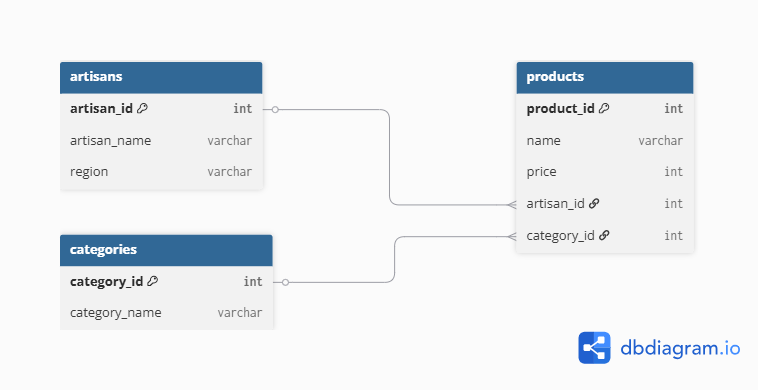

Sutradhar AI

Sutradhar AI is an AI-powered storytelling and business intelligence platform designed for handicraft artisans and MSMEs.

Features
AI Heritage Story Generator
Craft DNA Card
Smart Pricing Assistant
Digital Catalog Builder
Market Readiness Dashboard
Tech Stack
React.js
Tailwind CSS
React Router
FastAPI 
MongoDB Atlas 


## Backend Setup

### Navigate to the backend folder

```bash
cd backend
```

### Create a virtual environment

```bash
python -m venv venv
```

### Activate the virtual environment

#### Windows

```bash
venv\Scripts\activate
```

#### Linux/macOS

```bash
source venv/bin/activate
```

### Install dependencies

```bash
pip install -r requirements.txt
```

### Start the FastAPI server

```bash
uvicorn app.main:app --reload
```

The backend will run at:

```
http://127.0.0.1:8000
```

Swagger API Documentation:

```
http://127.0.0.1:8000/docs
```
## Database

### Database Choice

This project uses **MongoDB Atlas** as the cloud-hosted NoSQL database. MongoDB was chosen because it provides a flexible document-based data model that suits the artisan product information used in Sutradhar AI.

### Database Schema

The project contains the following collections:

- User
- Artisan
- Product

(A schema diagram is included below.)

### Database Setup

1. Create a MongoDB Atlas cluster.
2. Create a database user.
3. Whitelist your IP address.
4. Create a `.env` file inside the backend folder.
5. Add:

```env
MONGO_URI=your_connection_string
DATABASE_NAME=sutradhar_ai
```

6. Install dependencies:

```bash
pip install -r requirements.txt
```

7. Run the backend:

```bash
uvicorn app.main:app --reload
```

## Database Schema

The application uses MongoDB Atlas for persistent storage. The logical database design consists of three entities: Products, Artisans, and Categories. Each product is associated with one artisan and one category.



# Authentication & Security

The application now includes a complete authentication and authorization system to ensure secure access to protected resources.

## Authentication Features

- User Registration with secure password hashing using **bcrypt**
- User Login with **JWT Authentication**
- Google OAuth Login integration
- JWT-based Protected API Routes
- Protected Frontend Routes using React Router
- Secure Logout functionality

## Security Features

- Password hashing using bcrypt
- JWT token generation and validation
- Input validation for authentication endpoints
- Rate limiting for login and registration APIs
- CORS configuration for secure frontend-backend communication
- Environment variable configuration for sensitive credentials

# Authentication API Endpoints

| Method | Endpoint | Description |
|---------|----------|-------------|
| POST | `/api/auth/register` | Register a new user |
| POST | `/api/auth/login` | Authenticate user and generate JWT |
| POST | `/api/auth/google` | Login using Google OAuth |
| GET | `/api/auth/me` | Retrieve authenticated user information |

# Frontend Authentication

The React frontend implements secure authentication using:

- JWT storage in Local Storage
- ProtectedRoute component for authenticated pages
- Automatic redirection of unauthenticated users to the Login page
- Google Sign-In integration using Google OAuth

# Environment Variables

### Backend (.env)

```env
MONGO_URI=your_mongodb_connection_string
DATABASE_NAME=sutradhar_ai

JWT_SECRET=your_secret_key
ALGORITHM=HS256
ACCESS_TOKEN_EXPIRE_MINUTES=10080

GOOGLE_CLIENT_ID=your_google_client_id
```

### Frontend (.env)

```env
VITE_GOOGLE_CLIENT_ID=your_google_client_id
```

# API Documentation

Swagger UI is available at:

```
http://127.0.0.1:8000/docs
```

The authentication endpoints can be tested directly through Swagger UI or Postman using JWT Bearer Tokens.

# AI Heritage Story Generator

The AI Heritage Story Generator enables artisans and users to generate culturally rich heritage stories for traditional handicrafts using Google's Gemini AI model. The generated stories highlight the historical significance, craftsmanship, and cultural value of Indian handicrafts based on user-provided inputs.

## Features

- AI-powered heritage story generation using Google Gemini
- Generates stories based on:
  - Craft Name
  - State
  - Artisan Name
  - Speciality
- Automatically stores generated stories in MongoDB Atlas
- View previously generated stories
- Copy generated stories to clipboard
- Download generated stories as PDF

## AI Workflow

```
User Input
     │
     ▼
React Frontend
     │
     ▼
FastAPI Backend
     │
     ▼
Google Gemini API
     │
     ▼
Generated Heritage Story
     │
     ├────────► Display in React
     │
     └────────► Save to MongoDB Atlas
```

## AI API Endpoints

| Method | Endpoint | Description |
|---------|----------|-------------|
| POST | `/api/ai/story` | Generate a heritage story using Google Gemini |
| GET | `/api/ai/stories` | Retrieve all previously generated stories |

## AI Technologies Used

- Google Gemini API
- google-genai SDK
- FastAPI
- React.js
- MongoDB Atlas
- jsPDF

## Generated Story Features

Each generated story can be:

- Viewed instantly after generation
- Saved automatically in MongoDB Atlas
- Retrieved later through the Story History section
- Copied to the clipboard
- Downloaded as a PDF document

## AI Story Generation Process

1. User enters the craft details.
2. The frontend sends the request to the FastAPI backend.
3. FastAPI forwards the prompt to the Google Gemini API.
4. Gemini generates a heritage story.
5. The generated story is displayed in the application.
6. The story is stored in the MongoDB `Stories` collection for future reference.
